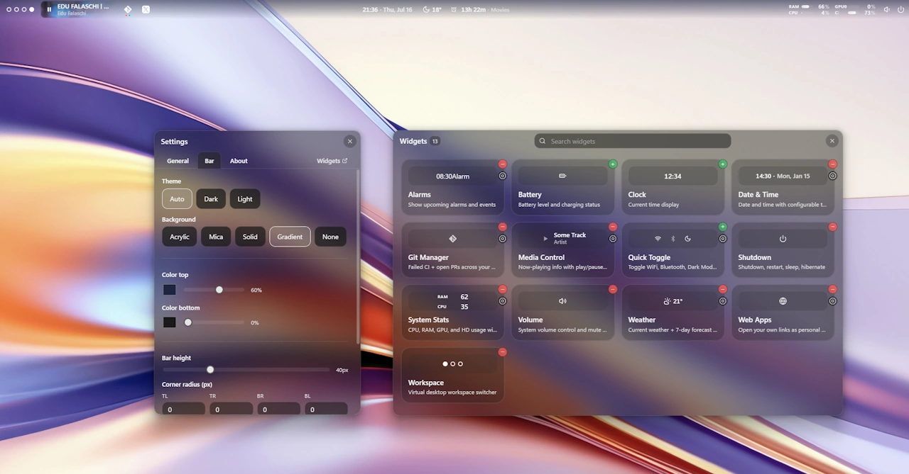

<p align="center">
  <picture>
    <source media="(prefers-color-scheme: light)" srcset="src-tauri/icons/defaults/icon-light.png">
    <source media="(prefers-color-scheme: dark)" srcset="src-tauri/icons/defaults/icon-dark.png">
    
  </picture>
</p>

<h1 align="center">Zenith</h1>

<p align="center">A customizable, always-on-top status bar for Windows&nbsp;11, docked to the top edge of your screen.</p>




<p align="center">
  <a href="#download">Download</a> &middot; <a href="#build-from-source">Build from source</a> &middot; <a href="#widgets">Widgets</a> &middot; <a href="#configuration">Configuration</a> &middot; <a href="#license">License</a>
</p>

<p align="center">
  <strong>Requires Windows 11 24H2 (build&nbsp;≥&nbsp;26100.2605).</strong>
</p>

---

## What is Zenith?

Zenith is a **top bar for Windows 11** — a custom, always-available status bar that docks to
the top edge of the screen.

Core ideas:

- **Stays on top and reserves space.** Zenith registers as a Windows **desktop AppBar**
  (`SHAppBarMessage`), so the shell shrinks the work area. Maximized windows stop *below* the
  bar and can never cover it — exactly like the native Taskbar.
- **Native transparency.** The bar, Settings, and Widget Manager windows use Windows **Acrylic**
  or **Mica** blur applied through the Win32 `SetWindowCompositionAttribute` accent API. The
  windows are fully transparent; the OS paints the blur.
- **Widget system.** Widgets are small, standalone apps (plain JS/CSS/HTML) living in
  `widgets/`. Each has a `manifest.json`. Users toggle them on/off in the Widget Manager;
  their order and position (left/center/right) are saved to config.
- **Fully customizable visuals.** The Settings window exposes the bar's material
  (Acrylic/Mica/None), tint transparency, background (transparent/solid/gradient), per-color
  transparency, corner rounding, edge margins, bar height, theme, and monitor selection.
  Changes apply live. Power users may additionally drop a `%APPDATA%\zenith\custom.css` that is
  hot-reloaded.
- **Right-click anywhere empty on the bar** → native context menu: **Settings · Widgets ·
  Restart Bar · Close Bar**.
- **Custom chrome.** No window uses the Windows title bar. Every window has a custom header:
  semi-bold title on the left, `×` close on the right. The Widget Manager header also has a
  search input.
- **Minimal footprint.** Goal is the lowest possible RAM and CPU. No heavy framework, no
  per-window CSS backgrounds, compositor-friendly animations only.

### Virtual desktop support

Zenith drives the virtual-desktop API via the [`winvd`](https://docs.rs/winvd) crate. The
Workspace widget shows one circle per virtual desktop; the active desktop is filled/colored,
others outlined. Click to switch, right-click to rename, delete, or create new desktops. This
requires Windows 11 24H2 (build ≥ 26100.2605) — users on older builds see a startup error and
the app exits.

---

## Download

Pre-built installers are published on the [Releases page](https://github.com/b7s/zenith/releases).

1. Go to <https://github.com/b7s/zenith/releases/latest>.
2. Download the **`Zenith_x.x.x_x64-setup.exe`** installer for the latest release.
3. Run the installer. Zenith is installed for the current Windows user (no admin elevation
   required) and added to **Start → Zenith** in your Start menu.
4. Launch **Zenith**. The bar appears docked at the top of your screen.
5. (Optional) Enable **Start with Windows** under Settings → General to auto-launch on login.

Zenith is also bundled with a **system tray icon** — right-click it to open Settings, open the
Widget Manager, check for updates, or quit.

### Update

Zenith checks for new releases in the background every 24 hours (gated by Settings → General →
Auto-update). When a new version is available, the tray icon shows a badge; click **Check for
updates** to open the releases page and download the new installer.

---

## Build from source

If you'd rather compile Zenith yourself, you'll need a Windows 11 (24H2+) machine with the Rust
toolchain and Node.js.

### Prerequisites

- [**Rust**](https://www.rust-lang.org/tools/install) (stable, edition 2021) — install via
  `rustup`.
- [**Node.js**](https://nodejs.org/) ≥ 20 (LTS recommended) and `npm`.
- [**Git**](https://git-scm.com/downloads).
- **Windows 11 24H2** (build ≥ 26100.2605) — required by the `winvd` crate.
- The [Microsoft C++ Build Tools](https://visualstudio.microsoft.com/visual-cpp-build-tools/)
  (MSVC) — required by the Rust linker on Windows.

### Clone

```bash
git clone https://github.com/b7s/zenith.git
cd zenith
```

### Install frontend dependencies

```bash
npm install
```

### Run in development mode

```bash
npm run tauri dev
```

This starts Vite (the frontend dev server) on http://localhost:1422 and launches the Tauri app
pointed at it. The bar appears at the top of your screen and hot-reloads on frontend changes.

### Build a production installer

```bash
npm run tauri build
```

The unsigned NSIS installer and the raw executable are written to
`src-tauri/target/release/bundle/`. Run the `*-setup.exe` to install.

> To produce a signed, distributable installer, see the
> [Tauri signing guide](https://v2.tauri.app/distribute/sign/) and supply the
> `TAURI_SIGNING_PRIVATE_KEY` / `TAURI_SIGNING_PRIVATE_KEY_PASSWORD` environment variables.

---

## Widgets

Widgets are the heart of Zenith. Each widget is a self-contained folder in `widgets/<id>/`
with a `manifest.json`, a `widget.html` fragment, an optional `widget.js` IIFE, and an optional
`widget.css`. The Rust backend scans the `widgets/` directory at startup — there is no central
registry to edit. To add a widget, just drop a new folder in `widgets/`; to remove one, delete
its folder.

Open the **Widget Manager** (right-click the bar → **Widgets**, or the tray icon) to toggle
widgets on/off, rearrange them (drag-and-drop across the bar's left / center / right zones), and
configure per-widget settings via the gear button.

### Shipped widgets

| Widget | Description | Default zone | Configurable |
|---|---|:---:|:---:|
| **Clock** | Current time display | left | — |
| **Date & Time** | Date and time with configurable timezone, 12/24h format, calendar popup with alarms/events and optional OneDrive sync | center | yes |
| **Workspace** | Virtual desktop switcher — one circle per desktop; click to switch, right-click to rename / delete / create | left | — |
| **Volume** | System volume control and mute toggle | right | — |
| **Battery** | Battery level and charging status | right | — |
| **Quick Toggle** | Toggle WiFi, Bluetooth, Dark Mode, Focus Assist, Airplane Mode, Night Light | right | yes |
| **Media Control** | Now-playing info with play/pause, next/previous, and seek | right | yes |
| **Weather** | Current weather + 7-day forecast from OpenWeatherMap (click to open forecast, air quality & charts) | right | yes |
| **System Stats** | CPU, RAM, GPU, HD usage with switchable styles (bar / dots / graph) | right | yes |
| **Alarms & Events** | Show upcoming alarms and events; relative or absolute time | right | yes |
| **Git Manager** | Failed CI + open PRs across your GitHub, GitLab, and Bitbucket accounts; send failures/PRs to your AI CLI | right | yes |
| **Web Apps** | Open your own links as personal web-app windows | right | yes |
| **Shutdown** | Shutdown, restart, sleep, hibernate, lock, logout | right | — |

### Adding a widget

Each widget folder follows this layout:

```
widgets/<name>/
├── manifest.json      # required — metadata (name, id, version, default_zone, icon, min_width, preview, optional config)
├── widget.html        # required — the HTML fragment injected into the bar
├── widget.js          # optional — IIFE that runs once on mount
└── widget.css         # optional — styles injected once per session
```

- `manifest.json` fields: `name`, `id`, `version`, `description`, `default_zone`
  (`left|center|right`), `icon` (a [Phosphor duotone](https://phosphoricons.com) icon name), `min_width`,
  `preview` (static HTML fragment shown in the Widget Manager card only — never rendered live),
  and optionally `config` (user-configurable settings, see the contract in `AGENTS.md` §9.4a).
- `widget.js` uses `window.__zenith_invoke` (set by the bar) to call Tauri commands — never
  imports from `@tauri-apps/api` directly.
- Add a widget by creating its folder; remove by deleting it. No code changes outside the
  folder are needed.

---

## Configuration

- **Location:** `%APPDATA%\zenith\config.json` (i.e. `C:\Users\<user>\AppData\Roaming\zenith\`).
- **Format:** JSON. Unknown keys are tolerated (forward-compatible). Missing keys fall back to
  defaults. A corrupt file never crashes the app — it falls back to defaults.

Most settings are best edited in the **Settings** window (right-click the bar → **Settings**),
which writes the config file for you. Power users can edit the JSON directly.

### Custom CSS

Drop a `custom.css` file in `%APPDATA%\zenith\` and enable it under Settings → Appearance →
Custom CSS. It is hot-reloaded — save the file and the bar restyles live.

---

## Tech stack

| Layer | Technology |
|---|---|
| Shell / backend | **Rust** (edition 2021) |
| App framework | **Tauri 2** |
| Windows interop | `windows` crate 0.61 + **`winvd` 0.0.49** (virtual-desktop COM API) |
| Frontend | Plain **TypeScript** + plain **CSS** (no React, no Vue) |
| Icons | [Phosphor Icons (duotone)](https://phosphoricons.com) |
| Design system | shadcn design tokens implemented in CSS (oklch) |
| Build / bundler | Vite 8 |
| Config format | JSON at `%APPDATA%\zenith\config.json` |

---

## License

Zenith is licensed under the [MIT License](./LICENSE).

    MIT License

    Copyright (c) 2026 b7s

    Permission is hereby granted, free of charge, to any person obtaining a copy
    of this software and associated documentation files (the "Software"), to deal
    in the Software without restriction, including without limitation the rights
    to use, copy, modify, merge, publish, distribute, sublicense, and/or sell
    copies of the Software, and to permit persons to whom the Software is
    furnished to do so, subject to the following conditions:

    The above copyright notice and this permission notice shall be included in all
    copies or substantial portions of the Software.

    THE SOFTWARE IS PROVIDED "AS IS", WITHOUT WARRANTY OF ANY KIND, EXPRESS OR
    IMPLIED, INCLUDING BUT NOT LIMITED TO THE WARRANTIES OF MERCHANTABILITY,
    FITNESS FOR A PARTICULAR PURPOSE AND NONINFRINGEMENT. IN NO EVENT SHALL THE
    AUTHORS OR COPYRIGHT HOLDERS BE LIABLE FOR ANY CLAIM, DAMAGES OR OTHER
    LIABILITY, WHETHER IN AN ACTION OF CONTRACT, TORT OR OTHERWISE, ARISING FROM,
    OUT OF OR IN CONNECTION WITH THE SOFTWARE OR THE USE OR OTHER DEALINGS IN THE
    SOFTWARE.
